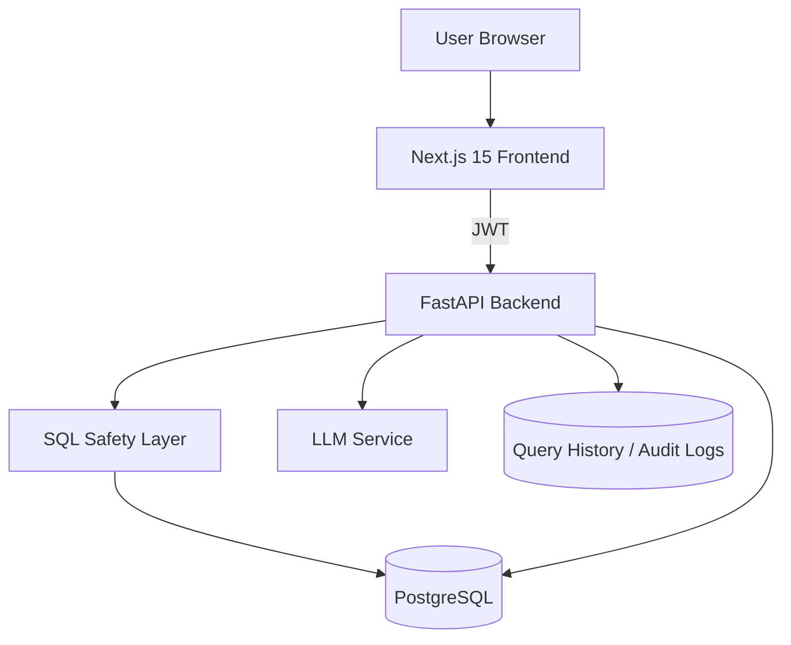

# AI SQL Agent Architecture

## Core Modules
- Frontend app router with marketing, auth, and dashboard areas
- Backend API v1 routes for auth, chat, history, explorer, dashboards
- SQL safety validator enforcing read-only SELECT
- Chart detector for line, bar, pie, scatter, and fallback table
- Query history, dashboard widgets, and audit logging

## Security Controls
- JWT access tokens
- Basic rate limiting middleware dependency
- Input validation via Pydantic
- SQL keyword deny-list and single-statement enforcement
- Server-side error sanitization
